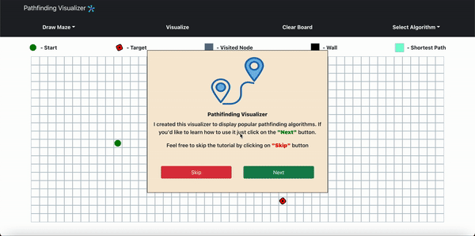

# Pathfinding Visualizer

## About the project
The vizualizer is designed to showcase how various pathfinding algorithms work in action. Every algotihm has its own specifics in terms of how best possible path is calculated. Some algorithms are faster, some are slower and some algorithms guarantee the shortest path while the others may not. Please explore the tutorial on how to use the vizualizer.  

## Algorithms
    1. Dijkstra Algorithm (Guarantees the shortest path and visits nodes in breadth first search manner).
    2. A* (A-star) Algorithm (Guarantees the shortest path and is arguable one of the most efficient pathfinding algotithms out there. Implements heuristics(distance from target node) into the equation.
    3. Depth Fisrt Search Algorithm does not guarantee the shortest path and takes quite some time to complete. 

## Technologies
    1. Javascript
    2. React.js
    3. CSS Animations(Keyframes)

## Contribution
Please submit a pull request with descriptive message and I will review as soon as possible

## Screenshots

## Links
[Github repo](https://github.com/Amal31497/pathfinding-visualizer) | [Deployed link](https://pathfinding-visualizer-amal-j.herokuapp.com/)

## License: 

  ##### Copyright: Amal Janabayev

  ##### 